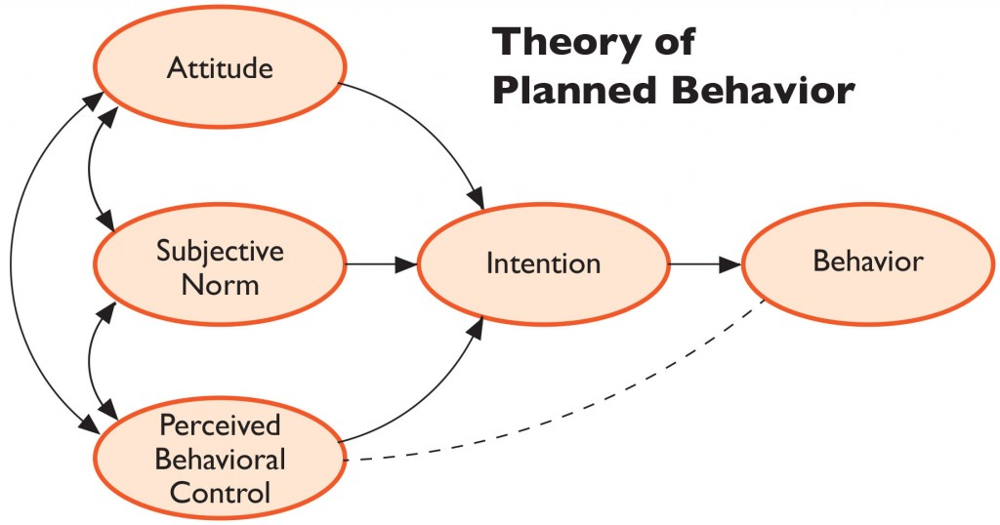

```{r setup, include = FALSE}
knitr::opts_chunk$set(echo = FALSE)
```

**ABSTRACT**

**The scope of this paper has been to use Machine Learning on the result
of the questionare "Tomater", which contains an array of 60 responces on
34 questions. The result of the machine learning sugests 2 factor groups
in the field of questions related to consumer perception and 4 clusters
of personality characteristics among the respondents. According to the
result of the multiple linear regression, including the factor scores,
buying intention is significantly related to income and product quality
perception, less related to product confidence, and not at all to sex.**

# Introduktion og Metodebeskrivelse

Denne opgave tager udgangspunkt i datasættet "Tomater", som er et
spørgeskema til belysning af forbrugeradfærd og fremtidig købsintention
hos danske konsumenter indenfor området "økologiske tomater".
Sammenligningsgrundlaget er "almindelige tomater". Spørgeskemaet består
af 60 observationer (svar) på hver 34 variabler (spørgsmål) og det er
opdelt i 4 dele: "Holdninger og tillid til vaner med økolgiske tomater",
"Indkøbsvaner", "Personkarakteristika" og "Demografiske Karakteristika".
Det er opgavens formål at vise hvordan der kan laves faktoranalyse,
klyngeanalyse og multipel lineær regression af spørgeskemaets
svarresultater. Indledningsvist diskuteres, med udgangspunkt i Henning
Olsens bog "Guide til gode spørgeskemaer" de problemstillinger
spørgeskema-oplægget kan give anledning til.

## Spørgeskemaet "Tomater" - beskrivelse af datagrundlaget

Af spørgeskemaet "Tomater" fremgår det, at der er taget udgangspunkt i
"The Theory of Planned Behavior". Den svarskala, der er anvendt er
"Likert-skalaen" med 7 svarmuligheder i de fleste spørgsmål. Dette er
set ud fra et ML (machine learning) synspunkt fornuftigt, da det gør det
nemmere at analyse dataene statistisk med Faktoranalyse, Klyngeanalyse
og Lineær Regression. Ulempen ved modellen er, at den bygger på
forudsætningen om at mennesker er rationelle væsner, hvilket jo ikke
nødvendigvis stemmer overens med virkeligheden.



(kilde:
<https://healthcommcapacity.org/hc3-research-primers-aid-in-sbcc-program-design/>)

# Kritisk vurdering af spørgeskemaet

I den kritiske vurdering af spørgeskemaet "Tomater" er der taget
udgangspunkt i checklisten fra Henning Olsens bog "Guide til gode
spørgeskemaer", og hvert punkt er behandlet for sig, og der er hvor det
har været nødvendigt, henvist til specifikke spørgsmålstyper, og ellers
er der kommenteret generelt gældende for hele spørgeskemaet.

## Styrende problemstillinger

Med "styrende problemstillinger" menes den overordnede problematik, der
ligger til grund for spørgeskemaet, herunder hvilken
dataindsamlingsform, der er anvendt. Til tildelte datasæt er et
spørgeskema, som er trykt på papir, og som svarpersonerne har kunnet
udfylde selv. Det fungerer specielt godt, når der er tale om
personkarakteristika, som i skemaets afsnit E, fordi der er tid til
eftertanke og forståelse af spørgsmålene. Desværre har
spørgeskemaudviklerne valgt at bruge tredjeperson ("hun"), hvilket med
fordel kunne have været skiftet ud med førsteperson ("jeg").
Spørgeskemaet "Tomater" handler om økologiske tomater, og danske
forbrugeres holdning og vaner til køb af økologiske tomater. De områder,
der søges afdækket, og som kan udledes af at læse spørgeskemaet, er
hvordan forbrugerne forholder sig til produktkvalitet og hvilken tillid
de har til økologiske tomater, som produkt. Men generelt er alle
spørgsmålene forbundet med den samme kategori af forbrugerholdning,
således at alle respondenter blot kan svare positivt for at bekræfte den
umiddelbare holdning (gængse holdning) udviklerne af spørgeskemaet har
til økologiske tomater, hvilket gør spørgeskemaet "ikke neutralt", men
ledende. Kun spørgsmål B9 afviger fra den "gængse forventning" til
økologiske tomater, og det kunne have været formålstjenligt med flere af
den slags spørgsmål. Forbrugernes forventning til prisen på økologiske
tomater indgår også, men er ikke vægtet så tungt som de andre. Generelt
er der ikke balance i hvor mange spørgsmål der tilhører hver
kategori/faktor, og faktoropdelingen kunne have været mere adskilt
såfremt der havde været planlagt bedre m.h.t. typefordelingen af
spørgsmålene. Dette understreges af faktoranalysen senere i opgaven. Ved
forsøg med både 2, 3 og 4 faktorer er der overlapning af spørgsmål. Der
kunne have været planlagt 4 faktorer: Pris, Kvalitet, Produktsikkerhed,
og Forbrugertillid og spørgsmålene skulle være mere kategoriserende og
mindre overlappende i faktoranalysen. Spørgeskemaet består for
størsteparten af holdningsspørgsmål, mens den mindste del er faktuelle
spørgsmål, som køn og geografiske data. Der mangler generelt en mere
klar opdeling af spørgsmålene, således at der ikke er så stort overlap
når disse skal opdeles på faktorer. Holdningsspørgsmål handler om at
evaluere eller vurdere fænomener, der forkommer uden for den, der
vurderer, f.eks. økologiske tomater. Holdningsspørgsmål kan være
specifikke eller generelle. Specifikke holdningsspørgsmål betyder at
svarpersonen skal forestille sig et bestemt scenarie, f.eks. at købe
økologiske tomater i en bestemt butik, mens generelle holdningsspørgsmål
handler om hvilken holdning svarpersonen generelt har til f.eks.
økologiske tomater. Spørgeskemaet indeholder flest generelle
holdsningsspørgsmål og kun få specifikke. B-spørgsmålene er alle
generelle holdningsspørgsmål. Spørgeskemaets E- og F-spørgsmål er
specifikke faktuelle spørgsmål om personkarakteristika og geografiske
data. Del C beskriver specifikke periodiske spørgsmål og relaterer til
svarpersonens humkommelse.

## Spørgsmålsforståelse

Gode spørgeskemaer skal være objektive, fokuserede og relevante, og det
er vigtigt for den senere undersøgelse af svarresultaterne, at
svarpersonerne forstår hvert spørgsmål efter hensigten. Generelt er der
nogle steder i spørgeskemaet Tomater for stor betydningsvidde, hvilket
betyder, at svarpersonerne kan misforstå spørgsmålene. Dette kunne løses
med en omformulering eller med en definitionstilføjelse.

## Genkaldelse af informationer

Spørgeskemaets afsnit C refererer til specifikke periodiske spørgsmål
med en tidsramme på op til 5 år. Det kan være svært for alle
svarpersoner at kunne huske tilbage på køb af økologiske tomater og når
der mangler et felt med "Ved ikke", så kan "magelig genkaldelse" blive
et problem. Eller der kan forekomme svarpersoner af typen "flydere", som
krydser af i det midterste felt, fordi det er det nemmeste, også selv om
køb af tomater ikke er et tabubelagt emne. For at hjælpe svarpersonen er
der derfor i spørgeskemaet hjælp til valg af perioder etc. og dette er
fornuftigt. Spørgsmål kan være åbne eller lukkede. Åbne spørgsmål lægger
op til at svarpersonen selv afgiver en forklaring med sine egne ord,
mens lukkede spørgsmål har specifikke svarmuligheder gældende for
samtlige svarpersoner. Åbne spørgsmål er langt sværere at efterbearbejde
end lukkede, og spørgeskemaet Tomater indholder lukkede spørgsmål,
hvilket gør det muligt at lave ML (Machine Learning) på resultatet.
Problemet med åbne spørgsmål er også at der nødvendigvis sker en
fortolkning undervejs, hvorved misforståelser af svar kan forekomme.
Spørgsmålene overholder reglen om at episodiske spørgsmål skal appellere
til "episodisk hukommelse", og ikke til "generel hukommelse".

## Konteksteffekter

Konteksteffekter findes i forskellige former, f.eks. disse 4:
Overensstemmelsesvirkning, betydningsvirkning, fratrækningsvirkning og
fokuseringsvirkning. Overensstemmelsesvirkning betyder, at svarpersonen
svarer på en række efter hinanden følgende holdningsspørgsmål ud fra at
svarene skal stemme overens med hinanden. Dette giver ikke nødvendigvis
et autentisk resultat. Et eksempel fra spørgeskemaet "Tomater" er B2 og
B3, hvor svarpersonen først skal tilkendegive sin holdning til om
økologiske tomater er dyrere end ikke-økologiske tomater (almindelige
tomater) og derefter svare på om økologiske tomater smager bedre end
ikke-økologiske tomater. Svarpersonen vil være tilbøjelig til at svare
at økologiske tomater smager anderledes for at retfærdiggøre en
eventuelt opfattet prisforskel. Betydningsvirkning forekommer når et
spørgsmål utilsigtet bidrager til at et efterfølgende forstås på en
bestemt måde. Dette går ud over neutraliteten/objektiviten i
spørgeskemaet. Et eksempel er holdningsspørgsmålene B7 og B8, hvor
tomater, der "ser mindre tiltalende ud" kan opfattes som "mere
naturlige". Fratrækningsvirkning opstår når svarpersonen forsøger at
"udjævne" sin holding hen over flere holdningsspørgsmål. Et eksempel kan
generelt forekomme i spørgeskemaet "Tomater´s" del E, hvor svarpersonen
skal vurdere sine egne personkarakteristika. Har vedkommende givet sig
selv en "høj score" i et spørgsmål, kan vedkommende for at udjævne give
en lidt mindre score i et relateret spørgsmål. Fokuseringsvirkning
forekommer når svarpersonen underliggende fokuserer på et bestemt
resultat af svar, f.eks. at økologiske tomater er noget positivt, og at
vedkommende derfor skal fokusere på at være positivt, og ikke neutralt
stemt overfor produktet. Definitionen i begyndelsen af spørgeskemaet
lægger op til at svaret på spørgsmålet B1 bliver skævvredet. På den
anden side er det en nødvendighed at definere hvad der menes med
økologiske tomater. Men det kunne være gjort i en parentes under det
enkelte spørgsmål. Dette gælder generelt hele spørgeskemaet, og
problemer med uønskede konteksteffeker kunne have været afbødet gennem
en reduktion af betydningsvidde, behersket anvendelse af tematiske
forløb (lidt vanskeligt med så snævert et emne), reduktion af
"magelig-genkaldelse" (afsnittet med specifikke periodiske spørgsmål),
og afprøvning af spørgeskemaer (Vi ved ikke om der er foretaget
afprøvning).

## Svarredigering

Selv hvis det utænkelige skulle ske, at hverken forståelse af spørgsmål,
genkaldelse af informationer eller konteksteffekter indebærer
måleproblemer, er svarpersoners svarredigering (selvredigering), dvs.
deres bearbejdelse af genkaldte informationer, yderligere en årsag til
måleproblemer. Flere undersøgelser peger på, at svarpersoner under
hensyn til, hvad de opfatter som "socialt ønskværdige" oplysninger, ofte
vurderer og redigerer genkaldte informationer før de svarer. Det kan
eksempelvis være ønskværdigt for svarpersonen at fremstå som en person,
der køber økologiske tomater, fordi dette opfattes som mere tiltalende,
også selom dette i realiteten ikke er sandt. Og derfor kan dette farve
svarene i spørgeskemaet "Tomater´s" afsnit B, som omhandler holdninger
til økologiske tomater, men også svarene i afsnit E, som omfatter
personkarakteristika, fordi svarpersonen måske svarer ud fra et "ideal"
og ikke ud fra en sandfærdig vurdering af egen person (dette kan være
mere eller mindre ubevidst).

(kilde:
<https://pure.vive.dk/ws/files/258013/0611_Guide_til_gode_Spoergeskemaer.pdf>)

# Faktoranalyse

For at finde frem til spørgsmålsfordelingen i det tildelte datasæt
"Tomater", laves der en faktoranalyse af svardataene fra spørgeskemaet.
Udgangspunktet er den bekræftende faktoranalyse, hvorefter resultatet af
denne sammenlignes med resultatet fra ML (machine learning)
faktoranalysen.

## Bekræftende- og undersøgende faktoranalyse

Confirmatory Factor Analysis (bekræftende faktoranalyse) og Exploratory
Factor Analysis (undersøgende faktoranalyse) er to forskellige tilgange
til faktoranalyse. Bekræftende faktoranalyse tager udgangspunkt i
spørgeskemaet, hvor vi på forhånd kender spørgsmålene og derfor er
istand til at kunne vurdere (eller gætte) hvilke områder det enkelte
spørgsmål relaterer til. Har vi ikke adgang til spørgeskemaet, men kun
dataene, så er vi nødt til at anvende undersøgende faktoranalyse, som
tager udgangspunkt i PCA (principal component analysis). I denne opgave
har jeg både lavet bekræftende- og undersøgende faktoranalyse.

### Bekræftende faktoranalyse - Faktoropdeling

Nedenstående viser fordelingen på to faktorer: "Kvalitet" og "Tillid",
såfremt spørgsmålene fra afsnit B i spørgeskemaet "Tomater" opdeles i 2
faktorer.

+--------------------------------+--------------------------------+
| f1: Forbrugertillid            | f2: Kvalitetsopfattelse        |
+================================+================================+
| B1                             | B1                             |
+--------------------------------+--------------------------------+
|                                | B2                             |
+--------------------------------+--------------------------------+
| B3                             | B3                             |
+--------------------------------+--------------------------------+
| B4                             |                                |
+--------------------------------+--------------------------------+
|                                | B5                             |
+--------------------------------+--------------------------------+
| B6                             | B6                             |
+--------------------------------+--------------------------------+
|                                | B7                             |
+--------------------------------+--------------------------------+
| B8                             |                                |
+--------------------------------+--------------------------------+
| B9                             |                                |
+--------------------------------+--------------------------------+

Som det ses er der en del overlapning af faktorerne, hvilket kan betyde,
at spørgsmålene ikke er lavet med udgangspunkt i en klar adskillelse som
optakt til senere faktoranalyse. Ved at forsøge med flere faktorer
bliver resultatet ikke bedre, hvilket understøtter førnævnte hypotese.

Problemet med manglende adskillelse af spørgsmålene giver senere
problemer med opdeling på faktorer i faktoranalysen.

### Undersøgende faktoranalyse - PCA (Principal Component Analysis)

For at finde frem til det optimale antal faktorer har jeg brugt PCA på
de under punkt 2 anvendte data, som omhandler "forbrugernes holdning og
tillid til vaner med økologiske tomater". PCA fjerner samtidigt
multikollinariteten fra det anvendte datasæt.

I hovedtræk finder der 2 typer PCA, med- og uden rotation. Der findes
desuden forskellige typer rotation. Jeg har brugt begge typer PCA i
denne opgave.

(kilde: <https://www.statmethods.net/advstats/factor.html>)

```{r}
pacman::p_load("tidyverse", "magrittr", "nycflights13", "gapminder",
"Lahman", "maps", "lubridate", "pryr", "hms", "hexbin",
"feather", "htmlwidgets", "broom", "pander", "modelr",
"XML", "httr", "jsonlite", "lubridate", "microbenchmark",
"splines", "ISLR", "MASS", "testthat", "caret", "gbm",
"RSQLite", "class", "babynames", "nasaweather", "pls",
"fueleconomy", "viridis", "boot", "devtools", "tree",
"glmnet", "gam", "akima", "factoextra", "randomForest",
"ggrepel", "GGally", "fmsb", "sjPlot", "rcompanion",
"leaps", "caretEnsemble", "dplyr")
```

```{r}
library(haven)
tomater <- read_sav("Data til eksamen (8).sav")
#View(tomater)
```

```{r}
library(readxl)
Faktorer_Tomater <- read_excel("Faktorer-Tomater.xlsx")
#View(Faktorer_Tomater)
```

```{r echo = FALSE, results='asis'}
library(knitr)
kable(Faktorer_Tomater, caption = "Faktorfordeling af B-spørgsmålene")
```

```{r}
library(stats)
```

```{r}
tomate <- tomater[,c(1:10)] #UDVÆLG ID + B SPØRGSMÅLENE (RÆKKE 1-10 )
```

```{r}
#tomate
```

```{r}
#problems(tomate) #CHECK FOR PROBLEMER
```

```{r}
#colSums(is.na(tomate)) #CHECK FOR NA´s
```

```{r}
Tomater <- tomate[,-1] #FJERN ID NUMMER FRA DATAENE
```

```{r}
#Tomater
```

------------------------------------------------------------------------

```{r}
# Determine Number of Factors to Extract - PCA ROTATED
library(nFactors)
ev <- eigen(cor(Tomater)) # get eigenvalues
ap <- parallel(subject=nrow(Tomater),var=ncol(Tomater),
  rep=100,cent=.05)
nS <- nScree(x=ev$values, aparallel=ap$eigen$qevpea)
plotnScree(nS)
```

Som det ses af plottet (Scree-plot) så giver 2 faktorer den største
ændring i forklaring, og jeg vil derfor arbejde videre med at opdele i 2
faktorer.


Machine Learning resultatet af den "undersøgende faktoranalyse" ser
anderledes ud end det "kvalificerede gæt" i den "bekræftende
faktoranalyse". Alle svar undtagen spørgsmål B9 giver positive loadings,
hvilket fortæller, at respondenterne generelt har en positiv holdning
til spørgsmålene, også de to mindre pæne sider af økologiske tomaters
kvalitet i spørgsmål B5 og B7. I den "undersøgende faktoranalyse" kommer
maskinen frem til at kun spørgsmålene B5 og B7 relaterer til faktor 2,
mens resten relaterer til faktor 1, herunder også B5, som går igen begge
steder. Det ses endvidere at "uniqueness" er høj for alle variablerne,
hvilket ikke er godt set ud fra et faktoranalyseperspektiv. Spørgsmål B5
og spørgsmål B7 minder om hinanden, idet de begge handler om et negativt
perspektiv på økologiske tomater, og opdelingen kunne derfor godt have
været "positive og negative sider af økologiske tomater". Generelt peger
resultatet i retning af, at der ikke er tænkt i faktoropdeling da
spørgsmålene blev lavet.

```{r}
library(stats)
```

```{r}
set.seed(123)
Tomater.fa_2 <- factanal(Tomater, factors = 2) #FAKTORANALYSE MED 2 FAKTORER
```

```{r}
Tomater.fa_2
```

## Communality og Uniqueness

I resultatet af faktoranalysen er det ønskværdigt med høj "communality"
indenfor hver enkelt faktor, samt lav "uniqueness". Datagrundlaget i
spørgeskemaet "Tomater´s" B-afsnit opfylder desværre ikke helt dette
kriterie, hvilket sandsynligvis skyldes, at spørgsmålene ikke på forhånd
har været dedikeret til et udvalgt undersøgelsesområde (læs
"faktor-område").

Communality:

```{r}
apply(Tomater.fa_2$loadings^2,1,sum) #COMMUNALITY
```

Uniqueness:

```{r}
1 - apply(Tomater.fa_2$loadings^2,1,sum) #UNIQUENESS
```

```{r}
Lambda <- Tomater.fa_2$loadings
Psi <- diag(Tomater.fa_2$uniquenesses)
S <- Tomater.fa_2$correlation
Sigma_2 <- Lambda %*% t(Lambda) + Psi #OPTIMAL NUMBER OF FACTORS
```

```{r}
#round(S - Sigma_2, 6) #RESIDUAL MATRIX
```

## Fortolkning af faktor-plot

De to faktorer i plottet fortæller noget om observationernes fordeling
på en holdnings-skala til økologiske tomater, og afspejler fint ideen
om, at spørgeskemaudviklerne ikke har tænkt i flere dimentioner (jf. 2.1
- Styrende problemstillinger). B5 omhandler, hvorvidt økologiske tomater
forventes at holde sig kortere tid end ikke-økologiske tomater. Normalt
opfattes det som dårlig kvalitet, at en grøntsat holder sig dårligere
end andre, men i dette tilfælde kan der ligge forventning om at
tomaterne ikke er konserverede med tilsætningsstoffer bag, og så
opfattes det som en positiv ting, at de holder sig kortere tid. B9
handler om hvorvidt tomater, der sælges som værende økolgiske kan være
ikke-økologiske. Det kan være svært for fobrugeren at vurdere og er i
sidste ende et spørgsmål om forbrugertillid og knap så meget om
kvalitetsvurdering.

```{r}
Tomater.fa_2.varimax <- factanal(Tomater, factors = 2, rotation = "varimax") #VARIMAX ROTATION - NULL SCORES
```

```{r}
#USING FACTANAL COMMAND:
nfactors <- 2
fit <- factanal(Tomater, nfactors, scores = c("regression"),rotation = "none")
print(fit)
```

```{r}
plot(Tomater.fa_2.varimax$loadings[,1], 
     Tomater.fa_2.varimax$loadings[,2],
     
     xlab = "Kvalitetsopfattelse", 
     ylab = "Forbrugertillid", 
     ylim = c(-1,1),
     xlim = c(-1,1),
     main = "Varimax rotation")

text(Tomater.fa_2.varimax$loadings[,1]-0.08, 
     Tomater.fa_2.varimax$loadings[,2]+0.08,
      colnames(Tomater),
      col="blue")
abline(h = 0, v = 0)
```

# Klyngeanalyse

For at finde frem til det optimale antal klynger har jeg lavet det, der
kaldes et "Scree-Plot", som viser hvor mange procent hver dimension
forklarer i modellen. Det er hensigtsmæssigt at vælge et antal klynger
der forklarer så meget som muligt. Scree kurven udviser et "blødt"
forløb, og jeg vælger derfor at arbejde med 4 fremfor 3 klynger. 4
klynger forklarer 78,7 procent og dette er tæt på de 80 procent som er
anbefalelsesværdigt.

```{r}
person <- tomater[,c(14,15,18,19,21,22,26,28)]
```

```{r}
#person
```

```{r}
#problems(person) #CHECK DATASET FOR PROBLEMS
```

```{r}
#colSums(is.na(person)) #CHECK FOR NA´s
```

```{r}
library(zoo)
```

```{r}
tomat_person <- na.aggregate(person) #SWAPS NA WITH MEAN VALUE
```

```{r}
tomate_person <- scale(tomat_person) #STANDARDIZE VALUES - NOT NESSESARY
```

------------------------------------------------------------------------

```{r}
library(tidyverse)
library(magrittr)
library(cluster)
library(cluster.datasets)
library(cowplot)
library(NbClust)
library(clValid)
library(ggfortify)
library(clustree)
library(dendextend)
library(factoextra)
library(FactoMineR)
library(corrplot)
library(GGally)
library(ggiraphExtra)
library(knitr)
library(kableExtra)
```

```{r}

res.pca <- PCA(tomate_person,  graph = FALSE)
#VISUALIZE EIGENVALUES AND VARIANCES
fviz_screeplot(res.pca, addlabels = TRUE, ylim = c(0, 50))
```

Nedenstående plot viser fordelingen af de fire klynger
personkarakteristiska, som således opdeler svarpersonerne i 4
persontyper. Det står ikke klart hvilke, og observationerne ligger som
en stor "klump" i midten af udfaldsrummet, hvorved det er svært at
definere hver enkelt klynge uden at anvende machine learning (ML).

```{r}
set.seed(123)
km.out_4=kmeans(tomate_person,4,nstart=20) #K-MEANS CLUSTERING WITH 4 CLUSTERS
#km.out_4
```

```{r}
fviz_cluster(km.out_4, data = tomate_person)
```

Det ses, at de 4 klynger i plottet har samme problem som faktorerne,
nemlig at de ikke er klart adskildte, hvilket understreger hypotesen om,
at spørgegrundlaget i "Tomater"-undersøgelsen ikke på forhånd har været
opdelt i tydelige persontyper, men ved at se på spørgsmålene kan vi
udlede noget om de to dimensioner i udfaldsrummet. Den ene akse kunne
fortælle noget om graden af "egoisme" og den anden akse kunne fortælle
noget om "at være noget for andre". Og så placerer observationerne sig i
et udfaldsrum mellem disse to akser. Der ser umiddelbart ikke ud til at
ligge nogen personlighedstest bag spørgsmålene.

# Faktor-scores og lineær-regression

```{r}
#SCORES FOR ALL ROWS:
head(fit$scores)
```

Faktor scores for de 2 faktorer "forbrugertillid" og
"kvalitetsopfattelse" indsættes i den multible lineære regression som
variabler og bliver derved en del af modellen for købsintention hos de i
materialet indeholdte respondenter.

Modellen kommer derfor til at se således ud: Model: C1 \~ Factor1 +
Factor2 + F1 + F7 + e,

Hvor C1 er købsintention som afhængig variabel og forbrugertillid,
kvalitetsopfattelse, køn og indkomst som uafhængige variabler.
Fejlleddet, eller den "uforklarede varians" beskrives i modellen af "e".

## Fortolkning af regressionsanalysen

Summary-outputtet af den multible lineære regression er vist følgende og
viser at der generelt ses en sammenhæng mellem "købsintention" og flere
af de uafhængige variabler.

```{r}
data1 <- tomater[,c(29,34)] #MAKE DATASET WITH VARIABLES F1 AND F7 (SEX AND INCOME)
#data1
```

```{r}
#problems(data1) #CHECK FOR PROBLEMS
```

```{r}
#colSums(is.na(data1)) #CHECK FOR NA´s
```

```{r}
library(zoo)
```

```{r}
data <- na.aggregate(data1) #SWAP NA FOR MEAN VALUE
```

```{r}
data2 <- tomater[,11] #MAKE DATASET WITH VARIABLE C1 (BUYING INTENTION)
#data2
```

```{r}
#problems(data2) #CHECK FOR PROBLEMS
```

```{r}
#colSums(is.na(data2)) #CHECK FOR NA´s
```

```{r}
library(zoo)
```

```{r}
data_i <- na.aggregate(data2) #SWAP NA FOR MEAN VALUE
```

```{r}
regdata <- cbind(data, data_i, fit$scores) #BIND THE DATA FROM F1 AND F7 TOGETHER WITH FACTOR SCORES
#Labeling the data

names(regdata) <- c("Sex", "Income", "Intention", "Quality",
                    "Confidence")
#head(regdata)
```

```{r}
glm_fit <- glm(Intention ~ Sex + Income + Quality + Confidence, data = regdata) #LINEAR REGRESSION WITH SCORES
```

```{r}
summary(glm_fit)
```

Det ses af den multiple lineære regressionsanalyse, at svarpersonens køn
ikke har nogen betydning for intentionen om køb/ikke køb af økologiske
tomater. Svarpersonens indkomst, samt perception af kvalitet har størst
betydning for intentionen om køb/ikke køb af økologiske tomater, og
svarpersonens tillid til produktet har mindst betydning.

# Opgavens Konklusion

Formålet med denne opgave har været at bruge Machine Learning på
datasættet "Tomater", som indeholder 60 respondenters svar på 34
spørgsmål om forbrugerholdninger og vaner med køb af økologiske tomater.
Der er lavet faktoranalyse på den del af spørgeskemasvarene, der
omhandler forbrugerholdning, og klyngeanalyse af respondenternes
personkarakteristika, samt multibel lineær regresssion af
respondenternes "købsintention" som funktion af køn, indkomst plus de to
faktor-scores fra faktoranalysen. Resultatet af regressionen viser, at
både indkomst og perception af produktkvalitet har stor betydning for
intentionen om køb/ikke køb, mens produktilliden har mindre betydning og
svarpersonens køn har ingen betydning.

------------------------------------------------------------------------

REFERENCER:

<https://pure.vive.dk/ws/files/258013/0611_Guide_til_gode_Spoergeskemaer.pdf>

<https://www.geo.fu-berlin.de/en/v/soga/Geodata-analysis/factor-analysis/A-simple-example-of-FA/index.html>)

<https://stackoverflow.com/questions/7072159/how-do-you-remove-columns-from-a-data-frame>

<https://uc-r.github.io/kmeans_clustering>

<https://www.youtube.com/watch?v=T2fcDmGpyhY>

<https://healthcommcapacity.org/hc3-research-primers-aid-in-sbcc-program-design/>

<https://www.statmethods.net/advstats/factor.html>

<https://www.statmethods.net/advstats/cluster.html>

<https://www.r-bloggers.com/2019/01/10-tips-for-choosing-the-optimal-number-of-clusters/>

<https://medium.com/analytics-vidhya/multiple-linear-regression-factor-analysis-in-r-35a26a2575cc>

https://rmarkdown.rstudio.com/lesson-3.html

